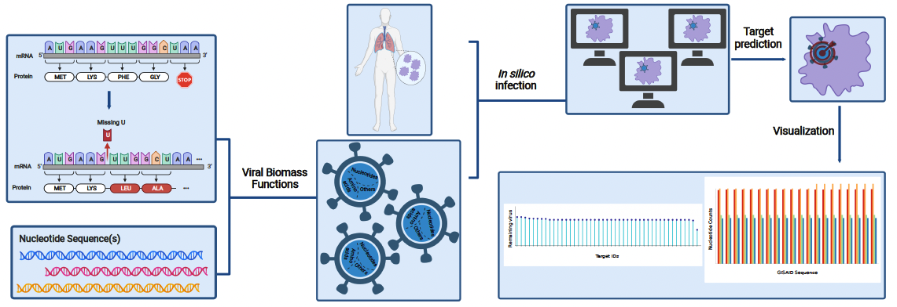

# pymCADRE 

[](http://opensource.org/licenses/LGPL-3.0)
[](https://github.com/draeger-lab/pymCADRE/releases/)


 

*Authors* : [Nantia Leonidou](https://github.com/NantiaL)

### Publication

When using pymCADRE in a research work, please cite the following work:

Leonidou, N., Renz, A., Mostolizadeh, R., & Dräger, A. (2023). New workflow predicts drug targets against SARS-CoV-2 via metabolic changes in infected cells. PLOS Computational Biology, 19(3), e1010903.
[](https://doi.org/10.1371/journal.pcbi.1010903)

### Overview. 

The **pymCADRE** tool is an advanced re-implementation of the metabolic Context-specificity Assessed by Deterministic Reaction Evaluation ([mCADRE](https://github.com/jaeddy/mcadre)) algorithm in Python. It constructs tissue-specific metabolic models by leveraging gene expression data and literature-based evidence, along with network topology information.

The reactions within the generic global model are being ranked, and the ones with the lowest supporting evidence for the tissue
of interest are given the highest priority for removal:
```
GM, C, NC, P, Z, model_C = rank_reactions(model, G, U, confidence_scores, C_H_genes, method)
```
If the generic functionality test is passed, the model undergoes pruning, which results in a context-specific reconstruction:
```
PM, cRes = prune_model(GM, P, C, Z, eta, precursorMets, salvage_check, C_H_genes, method)
```

### Installation
```
pip install pymcadre
```

### Prerequisites

This tool has the following dependencies:

python >=3.8.5

Packages:
* pandas
* numpy
* cobra
* requests
* os

### Input data
+ `model`: COBRA model structure for the metabolic model of interest
+ `precursorMets`: list of precursor, key, metabolites in form of .txt file
+ `confidence_scores`: literature/experimental-based confidence assigned to reactions in `model`

Tissue-specific expression evidence: 
+ `G`: list of Entrez IDs for all genes in `model`
+ `U`: list of ubiquity scores calculated for all genes in `model`

##### Optional Inputs
+ `salvageCheck`: flag whether to perform a functional check for the nucleotide salvage pathway (1) or not (0)
+ `C_H_genes`: list with Entrez IDs for genes with particularly strong evidence of activity in the tissue of interest
+ `method`: method to use internal optimizations, (1) flux variability analysis or (2) fastcc

### Outputs
+ `PM`: pruned COBRA tissue-specific model
+ `GM`: COBRA model after removing blocked reactions from the input global model
+ `C`: core reactions in `GM`
+ `NC`: non-core reactions in `GM` 
+ `Z`: reactions with zero expression across all samples after binarization
+ `model_C`: core reactions in the generic model (including blocked reactions)
+ `pruneTime`: total reaction pruning time 
+ `cRes`: result of model checks (consistency/function) during pruning
  

### Usage
To run pymCADRE, execute the notebook named main_pymcadre.ipynb or the python script named pymcadre.py. The scripts can be modified to the preferred parameters and input files. Jupyter notebooks with test runs and test scripts are also provided as reference points.


### Additional material
#### PREDICATE (<ins>**Predic**</ins>tion of <ins>**A**</ins>ntiviral <ins>**T**</ins>arg<ins>**e**</ins>ts): 


Steps: 
- introduction of mutations in the reference sequence based on the protein sequences 
- calculation of the necessary stoichiometric coefficients for the final virus biomass functions
- target detection using two approaches: reaction knock-outs and the host-derived enforcement
- visualizations that could give insights into the dataset and a better understanding of the results. 

The tool can be applied to either one or more nucleotide sequences and all existing RNA viruses. This makes it particularly advantageous and time-saving when studying multiple variants of a single virus. The number of genomic input sequences equals the number of the calculated VBOF.

To run the tool, set the constant variables to the file pathways where the desired files are stored.

